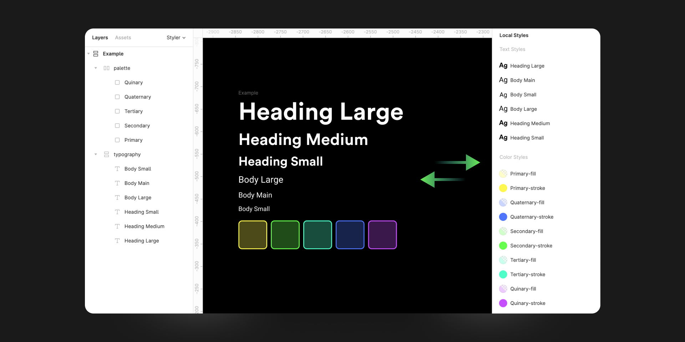

# Styler

Styler is a plugin for Figma that generates styles based on selected layers.  
Basically, you can control your styles by changing layer properties and updating the styles.

## Usage

- **Generate Styles**
  - **Create:** creates styles, when there is no match between layer and existing styles.
  - **Rename:** renames styles, when there is a style attached to the layer and no style with desired new name.
  - **Update:** update styles, when there is a name match.
- **Apply Styles:** apply styles to the selected layers.
- **Detach Styles:** detach styles of the selected layers.
- **Remove Styles:** remove styles based on the selected layers.
- **Remove By Type:** _Fill_, _Stroke_, _Text_, _Effect_, _Grid_

> It is much faster to use bulk rename feature of figma to rename layers `Cmd` `R` (Mac) or `Ctrl` `R` (Windows).
> [More info](https://help.figma.com/hc/en-us/articles/360039958934-Rename-Layers)

> Try to avoid same name for multiple layers. It will create a single style, but it will update its properties.

## Known issues

1. [Figma limitation] While trying to rename the styles using underscore `_` or point `.` prefixes, the style will not change the publish status (it will not become unpublish). ☹️
1. [Figma limitation] After you create styles, you cannot reorder them using Figma API. 😔

## Notes

1. Any change can be **Undo**.
1. Only **Local Styles** are supported. Still... You can use external styles to update local ones.
1. There is no support for **Groups** and I don't plan to support it.
1. The plugin, extract only text properties from text layers.
1. For layer that contains both fill and stroke properties, the plugin will add automatically a suffix to the style name `-fill` and `-stroke`, otherwise the style name will be exactly as the layer name. I plan to expand this.

## Pairing well with

1. [Themer](https://github.com/thomas-lowry/themer)
1. [Match fills to local styles](https://www.figma.com/community/plugin/783240561193792353/Match-fills-to-local-styles)

Many thanks to [Cristi Nica](https://github.com/cristi9512) for support.  
Inspired by [Sketch Style Generator](https://github.com/lucaorio/sketch-styles-generator) made by **Luca Orio**.
