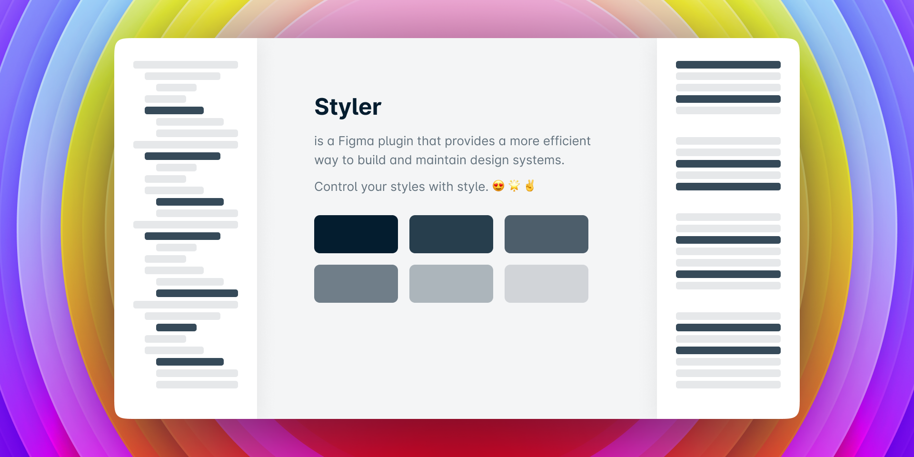

# Styler

This is a plugin for Figma that generates styles based on selected layers.  
Basically, you can control your styles by changing layer properties and updating the styles.

## Features

### Extract Styles 

Creates layers based on local styles.  
This can be useful to transfer style from a project to another, or for libraries that already have styles created, but needs to make bulk changes.

> Extract Styles will generate layers in the current page starting at position 0. (you'll be zoomed at the created layers)

### Generate Styles

Is a multi-purpose action for creating, renaming or updating styles based on layer properties.

- **Create,** when there is no match between layer and existing styles.
- **Rename,** when there is a style attached to the layer and no style with desired new name.
  > It is much faster to use bulk rename feature of figma to rename layers `Cmd` `R` (Mac) or `Ctrl` `R` (Windows).
  > [More info](https://help.figma.com/hc/en-us/articles/360039958934-Rename-Layers)
- **Update,** when there is a name match.

### Apply Styles

Currently, this action apply the styles based only on layer name and local styles found.

### Detach Styles

Works on selected layers.

### Remove Styles

- All Types
- By Fill Type
- By Stroke Type
- By Text Type
- By Effect Type
- By Grid Type

### Customize plugin 

- **Notification timeout:** changes the duration of all notification alerts that appears while interacting with Styler.
- **Show last style in description:** appends the name of the latest style that was applied to the layer to the current style description.
  > This is working nice with **Update using local styles** and remote styles that were applied before making the changes.
- **Update using local styles:** this option will change the behaviour of **Generate Styles** action and as results, local styles can be used as base to modify an existing style.  
  Is working only with local styles and sometimes produces unexpected results.  
  For example, if you'll try to rename layers from _layer-01, layer-02, layer-03_ to _layer-00, layer-01, layer-02_, instead of renaming, it will only rename 1 of them, and update the rest.
- **Extend name match:** also changes the behaviour of **Generate Styles** by looking for a partial name match between layer name and style name, as results will be many styles found.  
  _Use this with caution._
- **Texts per column** and **Frames per row** controls the grid of the extracted layers.

## Known issues

1. Some of the **Type details** of the text layers are not saved into the style. This is also a limitation of the API... 😭  
**[Fixed]** ~~1. While trying to rename the styles using underscore `_` or point `.` prefixes, the style will not change the publish status (it will not become unpublish). This is a limitation of the API. ☹️~~  
**[WIP]** ~~After you create styles, you cannot reorder them using Figma API. 😔~~

## Notes

1. Any change can be **Undo**.
1. Try to avoid same name for multiple layers. It will create a single style, but it will update its properties.
1. Only **Local Styles** are supported. Still... You can use external styles to update local ones.
1. There is no support for **Groups** and I don't plan to support it.
1. For text layers, styler gets only the text properties by default, but now is possible to get other properties by adding `+` as prefix to the layer name.

## Pairing well with

1. [Themer](https://github.com/thomas-lowry/themer)
1. [Match fills to local styles](https://www.figma.com/community/plugin/783240561193792353/Match-fills-to-local-styles)

Many thanks to [Cristi Nica](https://github.com/cristi9512) for support.  
Inspired by [Sketch Style Generator](https://github.com/lucaorio/sketch-styles-generator) made by **Luca Orio**.
